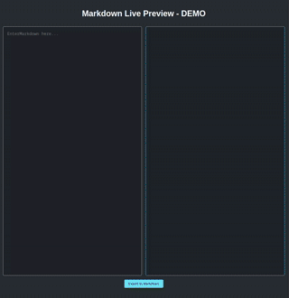

# markdown-live-preview

Based on [Mayanwolfe](https://www.twitch.tv/mayanwolfe)'s twitch
[livestream ](https://www.twitch.tv/videos/1969672680), built a markdown
previewer

**Link to original repo:** https://github.com/Mayanwolfe/Markdown_Live_Preview

## How It's Made:

**Tech used:** Vite, React, Marked, DOMpurify

Project built with React utilizing Vite. Marked package is utilized to parse
markdown, and DOMpurify to sanitize its input.
